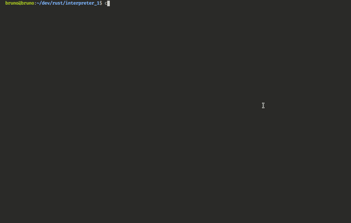

Toy language for learning purposes.

Based on: </br>

- http://journal.stuffwithstuff.com/2011/03/19/pratt-parsers-expression-parsing-made-easy/
- https://interpreterbook.com/
- https://craftinginterpreters.com/

**Running tests**

```console
> cargo t
```

**Starting the repl**

```console
> cargo run
```


